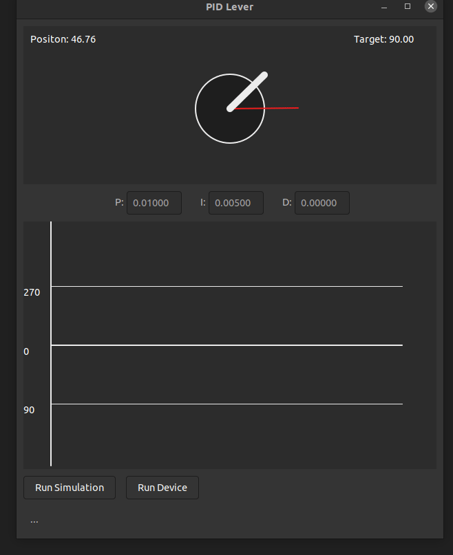

# PID Controller

The project describes a platform for developing and testing angular position PID controller.

Key components used:
- ATmega168 AVR microcontroller
- AS5600 12-bit contactless potentiometer
- 7V DC motor connected to VNH2SP30 H-Bridge driver

This is work in progress.

Compile and flash controller software
```
make -C src/AVR/ && make flash -C src/AVR/
```

Build GUI interface
```bash
make -C src/GUI/
```

Run GUI with controller serial port output and input 
```bash
out/PIDLeverGUI < /dev/ttyUSB0 > /dev/ttyUSB0
```



## Proportional component

